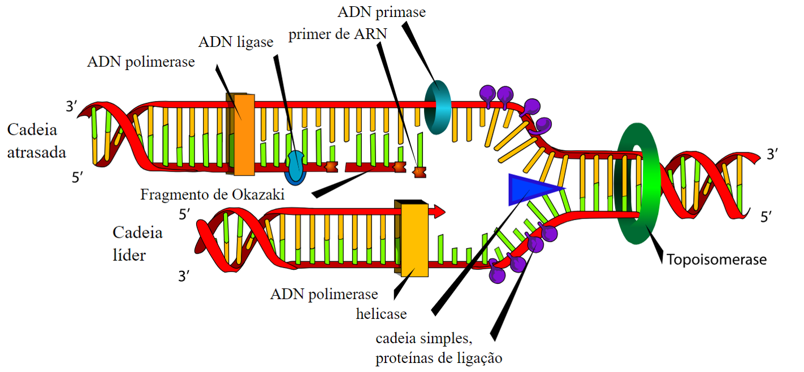

# Replicação do DNA

## Hipóteses de replicação

[**Hipótese semiconservativa**](#replica%c3%a7%c3%a3o-segundo-a-hip%c3%b3tese-semiconservativa): Cada uma das cadeias serviria de molde para uma nova cadeia e, consequentemente, cada uma das novas moléculas de DNA seria formada por uma cadeia antiga e uma cadeia nova (fig. 10A).
Outros investigadores da época defendiam que a molécula de DNA apresentava dimensões demasiado elevadas para que o desenrolamento da hélice ocorresse de forma eficaz. Surgiram, assim, outros dois modelos que, tendo por base a complementaridade das bases do DNA, tentavam explicar o mecanismo de replicação.

A **hipótese conservativa** admitia que a molécula de DNA progenitora se mantinha íntegra, servindo apenas de molde para a formação da molécula-filha, a qual seria formada por duas novas cadeias de nucleótidos (fig. 10B). Por outro lado, a **hipótese dispersiva** admitia que cada molécula-filha seria formada por porções da molécula inicial e por regiões sintetizadas de novo, a partir dos nucleótidos presentes na célula (fig. 10C).

## Replicação segundo a hipótese semiconservativa

### Processos por ordem

* Iniciação
* Alongamento
* Terminação

1. Desenrolamento da cadeia de DNA por ação da **Girase** (Topoisomerase); alivia a torção.
2. Quebra das pontes de hidrogénio entre as bases azotadas complementares por ação da enzima **Helicase**.
3. **DNA Primase** sintetiza **Primers** de RNA (RNA iniciador).
4. Ligação de **proteínas SSB / de ligação unifilamentares /  ligadoras de fita simples** para impedir que os nucleotídeos se voltem a ligar.
5. Enzima **DNA Polimerase III** aumenta os Primers adicionando nucleotídeos na extremidade 3’, para fazer a maior parte do novo DNA. Retira as proteínas SSB ao mesmo tempo. Sentido 5’ → 3’.
6. **DNA Polimerase I** vai remover os Primers e substituir com DNA. Sentido 5’ → 3’.
7. **DNA Ligase** vai ligar os fragmentos de Okazaki na fita descontínua.
8. **DNA Polimerase I & III** vão rever a duplicação (sentido indiferente).