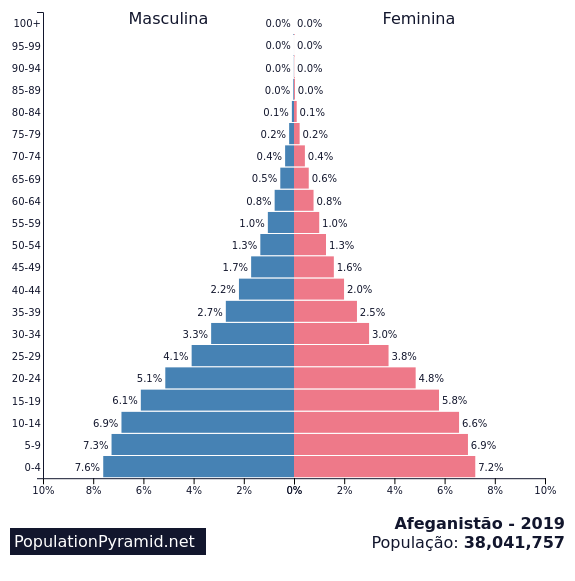
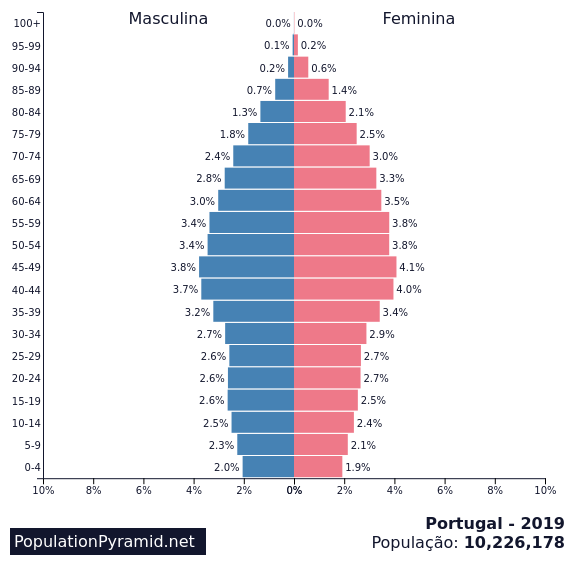

# Aula 2021-12-14

## Pirâmide etária (representação da estrutura etária)

> Página 70 do manual · https://www.populationpyramid.net/pt/mundo/2019/ · Páginas 168 e 169 do manual

* **P.D. (Envelhecimento da população)**
  * **Base estreita** 🠊 reduzido número de jovens
  * **Topo largo** 🠊 elevada esperança média de vida
* **P.E.D (Rejuvenescimento da população)**
  * **Base larga** 🠊 elevado número de jovens
  * **Topo estreito** 🠊 baixa esperança média de vida

 
