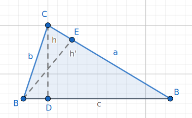
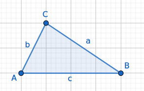

# Trigonometria

$$ \sin \alpha = \frac{\text{cateto oposto}}{\text{hipotenusa}} $$
$$ \cos \alpha = \frac{\text{cateto adjacente}}{\text{hipotenusa}} $$
$$ \tan \alpha = \frac{\text{cateto oposto}}{\text{cateto adjacente}} $$

---

$$ \frac{\sin \alpha}{\cos \alpha} = \frac{
    \frac{\text{cateto oposto}}{\text{hipotenusa}}
}{
    \frac{\text{cateto adjacente}}{\text{hipotenusa}}
} = \frac{\text{cateto oposto}}{\text{cateto adjacente}} = \tan \alpha $$
$$ \tan \alpha = \frac{\sin \alpha}{\cos \alpha} $$

## Fórmula Fundamental da Trigonometria

$$ \sin^2 \alpha + \cos^2 \alpha = 1 $$

### Dividir tudo por $\cos^2 \alpha$

$$ \frac{\sin^2 \alpha}{\cos^2 \alpha} + \frac{\cos^2 \alpha}{\cos^2 \alpha} + \frac{1}{\cos^2 \alpha} \Leftrightarrow $$
$$ \Leftrightarrow \tan^2 \alpha + 1 = \frac{1}{\cos^2 \alpha} $$

## Tabela(s) Trigonométrica

| | 30° / $\frac{\pi}{6}$ rad | 45° / $\frac{\pi}{4}$ rad | 60° $\frac{\pi}{3}$ rad |
| ---: | :---: | :---: | :---: |
| **$\sin \alpha$** | $\frac{1}{2}$ | $\frac{\sqrt{2}}{2}$ | $\frac{\sqrt{3}}{2}$ |
| **$\cos \alpha$** | $\frac{\sqrt{3}}{2}$ | $\frac{\sqrt{2}}{2}$ | $\frac{1}{2}$ |
| **$\tan \alpha$** | $\frac{\sqrt{3}}{3}$ | 1 | $\sqrt{3}$ |

| | 0° | 90° | 180° | 270° | 360° |
| ---: | :---: | :---: | :---: | :---: | :---: |
| **$\sin \alpha$** | 0 | 1 | 0 | -1 | 0 |
| **$\cos \alpha$** | 1 | 0 | -1 | 0 | 1 |
| **$\tan \alpha$** | 0 | N.D. | 0 | N.D. | 0 |

## Lei dos Senos

$$ \frac{\sin Â}{a} = \frac{\sin B̂}{b} = \frac{\sin Ĉ}{c} $$

## Lei dos Cossenos

$$ a^2 = b^2 + c^2 - 2 bc × \cos  $$
$$ b^2 = a^2 + c^2 - 2 ac × \cos B̂ $$
$$ c^2 = a^2 + b^2 - 2 ab × \cos Ĉ $$