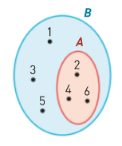

## Inclusão e ingualdade de conjuntos

### Inclusão de conjuntos

Considerando os conjuntos:

$A = \left\{ 1,4,6 \right\} \\
B = \left\{ 1,2,3,4,5,6 \right\}$

Diz-se que $A$ está contido no conjunto $B$ (ou que $A$ é um subconjunto de $B$).

$\forall x, x \in A \Rightarrow x \in B$

$A \subset B$

### Igualdade de conjuntos

Dados dois conjuntos, $B$ e $C$, diz-se que são iguais se e só se $B \subset C$ e $C \subset B$.

* $\forall x, x \in B \implies x \in C$, isto é, $B \subset C$;
* $\forall x, x \in C \implies x \in B$, isto é, $C \subset B$.

$B = C$

---

Dado que $A \subset B$

$A \cap B = A \\
A \cup B = B$

