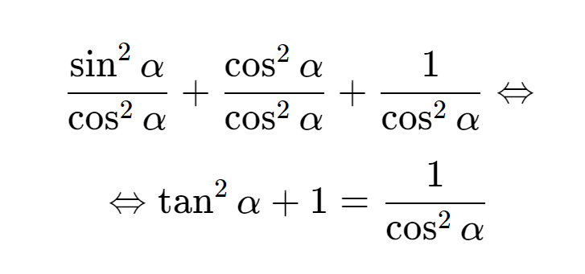

> **NOTA:**  
> Documentos na pasta *Matemática* devem conter equações matemáticas que não são corretamente apresentadas na renderização Markdown do GitHub à data de escrita desta mensagem (16/10/2019).
>
> **Exemplo:**  
> $$ \frac{\sin^2 \alpha}{\cos^2 \alpha} + \frac{\cos^2 \alpha}{\cos^2 \alpha} + \frac{1}{\cos^2 \alpha} \Leftrightarrow $$
> $$ \Leftrightarrow \tan^2 \alpha + 1 = \frac{1}{\cos^2 \alpha} $$

